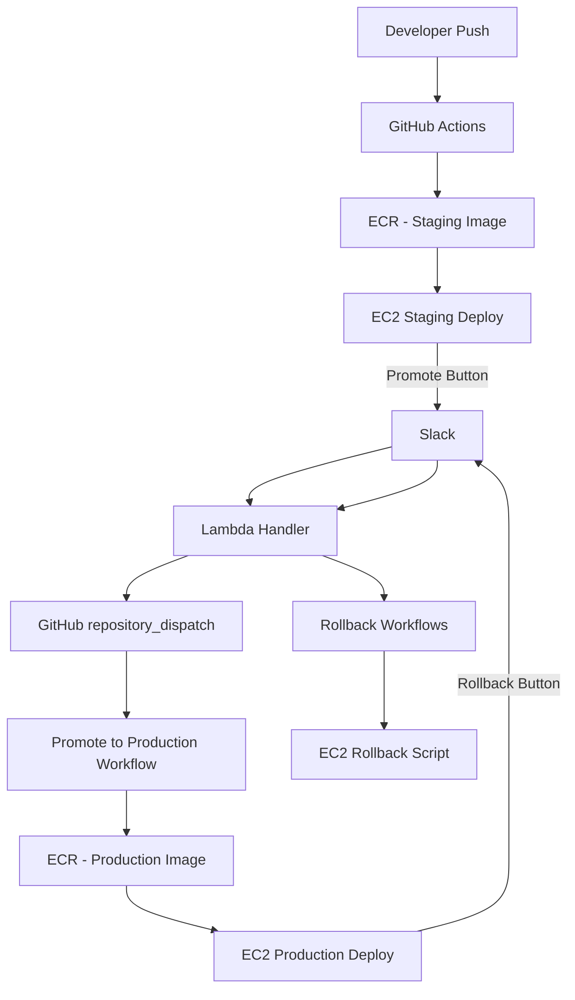

# DevOps Deployment Automation — Production‑Grade CI/CD with Slack Control

A fully automated, stateless CI/CD pipeline for deploying a Dockerized application to AWS EC2 using:

- **GitHub Actions**
- **AWS ECR + EC2**
- **Shell scripting (Bash)**
- **Slack interactive buttons**
- **AWS Lambda + API Gateway**
- **Version History + Rollback**
- **Staging → Production Promotion**

This project demonstrates real‑world DevOps engineering with production‑grade patterns, auditability and Slack‑driven deployment control.

---

# 📛 Badges


---

# 🚀 Architecture Overview

## CI/CD Pipeline Architecture



## CI/CD Pipeline Architecture

```
Developer
   ↓
GitHub → GitHub Actions → AWS ECR → EC2 Deployment Script
                         ↓
                       Slack
                         ↓
                   Lambda (index.js)
                         ↓
                GitHub repository_dispatch
```

---

# 🛠️ Technologies Used

- GitHub Actions (CI/CD)
- AWS ECR (container registry)
- AWS EC2 (compute)
- AWS Lambda (Slack → GitHub bridge)
- API Gateway (Slack webhook endpoint)
- Docker (containerization)
- Bash (deployment & rollback scripts)
- Slack Block Kit (interactive buttons)

---

# 🗂️ Repository Structure

```
.github/workflows/
    deploy_staging.yml
    deploy_production.yml
    promote_to_production.yml
    rollback_preview.yml
    rollback_confirm.yml
    rollback_cancel.yml
    rollback_production.yml

scripts/
    deploy_staging.sh
    deploy_production.sh
    rollback_production.sh
    healthcheck.sh
    logs.sh

lambda/
    index.js

version files:
    last_version_staging.txt
    last_version_production.txt
    previous_version_production.txt
```

---

# 🧩 Slack Integration (Phase‑2)

Slack is the control plane for production operations.

### Buttons available
- **Promote to Production**
- **Rollback Production**
- **Confirm Rollback**
- **Cancel**

### Flow
1. User clicks **Rollback Production**
2. Slack → Lambda → GitHub → Slack preview
3. User clicks **Confirm** or **Cancel**
4. Lambda → GitHub → EC2 (if confirmed)

This ensures **no accidental rollbacks** and full auditability.

---

# 🗂️ Version History

Two files track production versions:

```
last_version_production.txt
previous_version_production.txt
```

These are updated automatically during deploys and promotions.

Rollback always targets the previous version.

---

# 🔄 How Rollback Works

1. User clicks **Rollback Production** in Slack  
2. Lambda triggers `rollback_preview.yml`  
3. Slack shows:
   - Current version  
   - Target version  
   - Confirm / Cancel buttons  
4. If confirmed:
   - Lambda triggers `rollback_confirm.yml`
   - GitHub dispatches `rollback_production_internal`
   - EC2 pulls the previous version from ECR
   - EC2 restarts the container  
5. Slack reports rollback completion

This provides **safe, controlled, auditable rollbacks**.

---

# ⚙️ Workflows

### 1. deploy_staging.yml
Triggered on push to `main`:
- Builds Docker image
- Pushes to ECR
- Deploys to staging EC2
- Sends Slack success/failure message
- Shows **Promote to Production** button

---

### 2. promote_to_production.yml
Triggered by Slack:
- Reads staging version
- Retags staging image as production
- Deploys to production EC2
- Updates version files
- Commits version files back to GitHub
- Sends Slack success/failure message

---

### 3. deploy_production.yml
Manual workflow:
- Builds production image
- Pushes to ECR
- Updates version history
- Commits version files back to GitHub
- Deploys to EC2
- Sends Slack message with **Rollback Production** button

---

### 4. rollback_preview.yml
Triggered by Slack:
- Reads version files from GitHub
- Sends Slack preview with:
  - Current version  
  - Target version  
  - Confirm / Cancel buttons

---

### 5. rollback_confirm.yml
Triggered by Slack:
- Sends Slack “Rollback Confirmed”
- Triggers internal rollback workflow
- Sends Slack “Rollback Completed”

---

### 6. rollback_cancel.yml
Triggered by Slack:
- Sends Slack “Rollback Cancelled”

---

### 7. rollback_production.yml (internal only)
Triggered by:
```
rollback_production_internal
```
Executes the actual rollback on EC2.

---

# 🧠 Lambda (index.js)

Handles Slack interactive actions:

- `promote_to_production`
- `rollback_production` → preview
- `rollback_confirm`
- `rollback_cancel`

Sends GitHub repository_dispatch events.

---

# 🖥️ EC2 Deployment Scripts

Located in:

```
scripts/
```

Includes:

- `deploy_staging.sh`
- `deploy_production.sh`
- `rollback_production.sh`
- `healthcheck.sh`
- `logs.sh`

These scripts run directly on EC2.

---

# 🔐 Security Considerations

- All secrets stored in GitHub Actions → **encrypted at rest**
- SSH private key stored as a GitHub secret
- IAM user restricted to:
  - ECR push/pull
  - EC2 SSH
- Lambda uses a minimal‑scope GitHub token
- No long‑lived state on EC2 (stateless deployments)
- Version files committed with `[skip ci]` to avoid pipeline loops

---

# 🧪 Testing Phase‑2 (Confirm/Cancel)

We test in this exact order:

1. Push all updated workflows + README to GitHub  
2. Trigger a staging deploy  
3. Promote to production  
4. Trigger rollback preview  
5. Confirm rollback  
6. Validate rollback  
7. Test Cancel  

Everything should work end‑to‑end.

---

# 🔧 Troubleshooting

### ❌ Rollback fails with “manifest not found”
Cause: Wrong ECR region or repo name in rollback script  
Fix: Ensure rollback script uses:

```
eu-north-1
myapp-production
```

---

### ❌ Slack buttons not responding
Cause: Lambda token expired or wrong  
Fix: Update `GITHUB_TOKEN` in Lambda environment variables.

---

### ❌ Version history not syncing
Cause: Version files not committed back to GitHub  
Fix: Ensure both deploy + promote workflows include:

```
git commit -m "chore: update version files [skip ci]"
```

---

# 🔄 Relaunch From Scratch (Full Reset)

To rebuild the entire system:

1. Create new EC2 instances (staging + production)  
2. Create new ECR repos:
   - `myapp-staging`
   - `myapp-production`
3. Recreate IAM user with:
   - ECR push/pull
   - EC2 SSH
4. Recreate Lambda + API Gateway  
5. Add secrets to GitHub Actions  
6. Push code → pipeline auto‑rebuilds itself  

---

# ⭐ Why This Project Matters

This project demonstrates:

- Real‑world CI/CD automation  
- Slack‑driven deployment control  
- Safe, auditable rollbacks  
- Stateless deployment architecture  
- GitHub Actions + AWS integration  
- Production‑grade DevOps patterns  
- Version history + rollback logic  
- Multi‑environment promotion flow  

This is the kind of system used in **actual companies**.

---

# 🏁 Project Status

Phase‑2 (Confirm/Cancel Rollback) — **COMPLETE**  
Slack → Lambda → GitHub → EC2 — **Fully operational**  
Version History — **Enabled**  
Rollback Safety — **Enabled**  
Promotion Flow — **Enabled**
